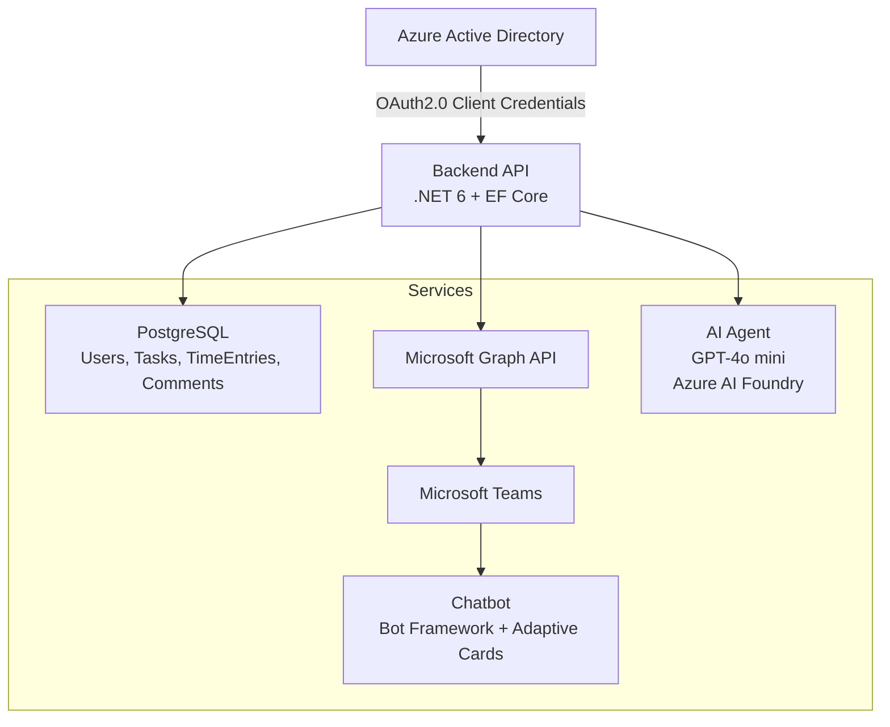

# 🤖 Teams Task & Time Tracking Bot

Aplikacja backendowa zintegrowana z **Azure Active Directory (AAD)**, **Microsoft Graph API** i **Microsoft Teams**, która umożliwia monitorowanie aktywności użytkowników, zarządzanie zadaniami oraz rejestrowanie czasu pracy w kontekście współpracy zespołowej.  

> Projekt zrealizowany podczas stażu — w pełni działający proof-of-concept pokazujący integrację środowiska Microsoft 365 z własnym systemem zarządzania zadaniami.

---

## 🧠 Cel aplikacji

- 🔐 **Synchronizacja użytkowników** z Azure Active Directory (AAD)  
- 📡 **Integracja z Microsoft Graph API** (użytkownicy, kanały, wiadomości)  
- 🤖 **Czatbot dla Teams** interpretujący akcje użytkowników  
- ⏱️ **Monitorowanie czasu pracy** i aktywności przy zadaniach  
- 📊 **Raportowanie** czasu pracy i postępów, dostępne tylko dla użytkowników z odpowiednimi rolami  

---

## 🏗️ Architektura systemu

---

## 🏗️ Główne komponenty

### 🔐 Synchronizacja AAD
- OAuth2.0 (**client credentials flow**, client secret)  
- **Role-based auth** w Azure (endpointy zabezpieczone)  
- Synchronizacja użytkowników → **PostgreSQL**  
- Realizowana w **Azure Function** (cron + webhook refresh)  

### 📡 Microsoft Graph API
- Pobieranie użytkowników 
- Dostęp do wiadomości na kanale Teams 
- Integracja z **Plannerem** (reprezentacja zadań z DB w Plannerze)  

### 🤖 Chatbot
- **Wersja 1:** Graph API (`sendMessage`) → bot odpowiadał jako użytkownik w wątku „BOT”  
- **Wersja 2 (finalna):** Microsoft Bot Framework  
  - Obsługa **Adaptive Cards** (interaktywne odpowiedzi, doprecyzowanie akcji)  
  - **AI agent** (GPT-4o mini w Azure AI Foundry) → klasyfikacja wiadomości, zwrot JSON z akcją i parametrami  
  - **Regexy** → smalltalk (przywitania, podziękowania)  

### ⏱️ Monitorowanie czasu pracy
- Rejestrowanie rozpoczęcia i zakończenia pracy nad zadaniem  
- Ręczne logowanie czasu (np. `"Zaloguj 2h do zadania #123"`)  
- Dane w PostgreSQL (zadanie, użytkownik, czas start, czas end, komentarze)  
- Raporty dostępne przez **API i w Teams** (tekstowo), tylko dla uprawnionych użytkowników  

---

## ⚙️ Stack technologiczny
- **Backend:** .NET 6, C#, EF Core  
- **Baza danych:** PostgreSQL  
- **Chmura:** Azure Active Directory, Microsoft Graph API  
- **Bot:** Microsoft Bot Framework + Adaptive Cards  
- **AI Agent:** GPT-4o mini (Azure AI Foundry)  
- **Dev:** Localhost + DevTunnel (do webhooków), middleware (auth)  

---

## 📽️ Demo
👉 🎥 *[Link do nagrania](https://youtu.be/orO73-8EAoI)*  

### Przykłady interakcji:
- `"Rozpoczynam pracę nad zadaniem task"` → bot rejestruje czas rozpoczęcia  
- `"Zaloguj 2h do zadania task"` → czas ręcznie wpisany (zakładamy rozpoczęcie 2 godziny od momentu wysłania wiadomości)  
- `"Usuń"` → bot dopytuje kartą **Adaptive Card**, które zadanie usunąć  

---

## 🔐 Bezpieczeństwo
Endpointy zabezpieczone **role-based access control (RBAC)** w Azure  

**Przykładowe role:**
- `timeTracker` – dostęp do zapisywania czasu  
- `taskDeleter` – usuwanie zadań  
- `admin` – pełny dostęp  

Każde żądanie Graph API → **OAuth 2.0 client credentials flow**  

---

## 👤 Autor
Projekt zrealizowany podczas stażu w **Elastic Cloud Solutions Sp. z o.o.**  

**Łukasz Kucikowicz**

